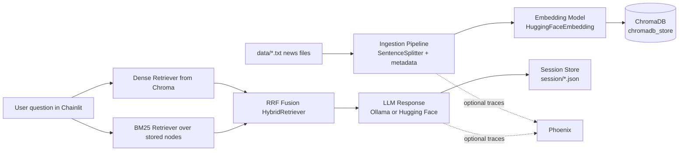

# RAG Project: Hong Kong News Chatbot

This repository contains a local Retrieval-Augmented Generation (RAG) system built for Hong Kong news data. It provides:

- A persistent vector database (ChromaDB) with article chunks and metadata.
- A hybrid retriever (dense + BM25) fused with Reciprocal Rank Fusion (RRF).
- A Chainlit chat UI with persistent chat sessions.
- Notebook-first data ingestion and model experimentation workflows.
- Optional Phoenix tracing for ingestion and inference observability.

The core goal is practical local RAG development: ingest real news corpora, run retrieval + generation, inspect behavior, and iterate quickly.

## What This Repo Includes

- **News corpus folders** under `data/` (HK Free Press, HK01, The Standard).
- **Vector store persistence** under `chromadb_store/`.
- **Reusable RAG package** under `src/rag/` split into:
	- `core/` (shared embeddings + observability foundations)
	- `ingestion/` (pipeline/config/admin tools)
	- `inference/` (chatbot, retrievers, session store, app factory)
- **Interactive notebooks** under `notebook/` for ingestion/admin/inference.
- **Chainlit app entry point** in `app.py`.
- **Chat session persistence** in `session/*.json`.

## Architecture Overview



## Default Runtime Configuration

Current defaults in code are set for a lightweight local run profile:

- **Collection name**: `run_testing`
- **Embedding model**: `BAAI/bge-small-en-v1.5`
- **LLM provider**: `ollama`
- **Ollama model**: `gemma3:1b`
- **Final top-k retrieval**: `5`

These values are defined in `src/rag/inference/inference_config.py` and `src/rag/ingestion/ingestion_config.py`.

## Prerequisites

1. Python 3.11+ (virtual environment recommended)
2. Ollama installed locally (if using default provider)
3. Local model pulled in Ollama (default: `gemma3:1b`)

PowerShell example:

```powershell
python -m venv .venv
.\.venv\Scripts\Activate.ps1
pip install --upgrade pip
pip install chainlit chromadb tqdm llama-index llama-index-llms-ollama llama-index-embeddings-huggingface llama-index-vector-stores-chroma llama-index-retrievers-bm25
```

Optional observability packages:

```powershell
pip install arize-phoenix arize-phoenix-otel openinference-instrumentation-llama-index
```

## Quick Start: Run the Chat App

1. Make sure your vector collection already contains data (see ingestion section below).
2. Start Chainlit:

```powershell
$env:ENABLE_PHOENIX="1"            # optional
$env:LAUNCH_PHOENIX_SERVER="1"     # optional
chainlit run app.py -w
```

3. Open the app URL printed by Chainlit (typically http://localhost:8000).
4. If Phoenix server is launched, open: http://127.0.0.1:6006

## Chat UX Commands

Inside Chainlit chat:

- `/chats` : show saved sessions
- `/new` : create a new local chat session
- `/load <chat_id>` : load a prior chat
- `/observability` : show current Phoenix configuration/status

## Ingestion Workflow (Notebook-First)

Primary notebook: `notebook/ingestion.ipynb`

High-level flow:

1. Read and clean `.txt` files from configured source folders.
2. Parse metadata from file paths and names.
3. Chunk documents (sentence splitter with configured overlap).
4. Embed in batches.
5. Upsert to Chroma collection with scalar-safe metadata.

By default, ingestion config currently includes only `hk_free_press_news` as a source folder. You can enable more sources in `src/rag/ingestion/ingestion_config.py`.

## Retrieval and Inference Design

The inference stack uses a hybrid retriever:

- **Dense retrieval** from Chroma vector index.
- **Keyword retrieval** using BM25 over stored nodes.
- **Fusion** using reciprocal rank fusion (RRF), which avoids manual score normalization.

This improves robustness across exact-phrase and semantic-style queries.

## Data and Metadata Conventions

News file naming pattern is expected to be:

`<date>_<title>.txt`

Metadata extracted during ingestion includes:

- `source_type`
- `source_folder`
- `article_date`
- `article_title`
- `file_name`
- `file_path`
- chunk metadata such as `chunk_number`, `chunk_size`, `chunk_overlap`

## Project Structure

```text
.
|- app.py
|- chromadb_store/
|- data/
|- notebook/
|  |- ingestion.ipynb
|  |- inference.ipynb
|  |- admin.ipynb
|  \- data_generation/
|- session/
|- src/
|  \- rag/
|     |- core/
|     |- ingestion/
|     \- inference/
\- README.md
```

## Security Notes

- Avoid storing API keys in source files.
- Prefer environment variables such as `HF_TOKEN`, `HUGGINGFACEHUB_API_TOKEN`, or `HUGGINGFACE_API_KEY`.
- If using `src/utils_private.py`, make sure secrets are not committed.

## Observability (Phoenix)

### App tracing

Enable and run app with:

```powershell
$env:ENABLE_PHOENIX="1"
$env:LAUNCH_PHOENIX_SERVER="1"
chainlit run app.py -w
```

### Notebook tracing

From terminal:

```powershell
phoenix serve
```

Then execute ingestion/inference notebook cells to emit traces.

## Common Issues

- **Empty answers or weak grounding**: verify the target Chroma collection has vectors and matches the configured collection name.
- **Model errors**: ensure Ollama is running and the configured model is pulled.
- **No Phoenix traces**: check env flags and package installation.
- **Hugging Face provider fails**: verify token is present in environment variables.

## Suggested Next Improvements

1. Add a pinned `requirements.txt` or `pyproject.toml` for reproducible setup.
2. Add a scripted ingestion CLI entry point for non-notebook runs.
3. Add retrieval quality benchmarks (Hit@k, MRR, answer faithfulness) as a repeatable test step.
4. Add source-level filtering (by provider/date window) in the chat UI.