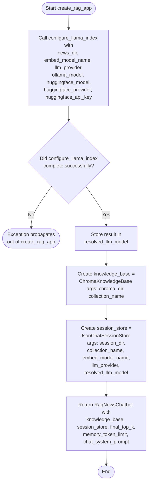

# create_rag_app Flowchart

```mermaid
flowchart TD
    A([Start create_rag_app]) --> B["Call configure_llama_index with<br/>news_dir, embed_model_name, llm_provider,<br/>ollama_model, huggingface_model,<br/>huggingface_provider, huggingface_api_key"]

    B --> C{"Did configure_llama_index<br/>complete successfully?"}
    C -- No --> X(["Exception propagates<br/>out of create_rag_app"])
    C -- Yes --> D["Store result in<br/>resolved_llm_model"]

    D --> E["Create knowledge_base =<br/>ChromaKnowledgeBase args: chroma_dir, collection_name"]
    E --> F["Create session_store =<br/>JsonChatSessionStore args: session_dir,<br/>collection_name, embed_model_name,<br/>llm_provider, resolved_llm_model"]
    F --> G["Return RagNewsChatbot with<br/>knowledge_base, session_store, final_top_k,<br/>memory_token_limit, chat_system_prompt"]
    G --> H([End])
```
