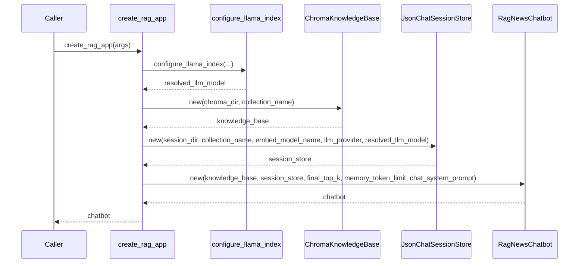

# create_rag_app Logic Specification

## Why this document exists
This records behavior as an implementation contract, so people can validate code changes quickly without re-reading all source lines.

## Function purpose
`create_rag_app` builds and returns a ready-to-use `RagNewsChatbot` wired with:
- LlamaIndex global settings (embedding model and LLM)
- Chroma-backed knowledge base
- JSON-backed chat session store

## Inputs
- `chroma_dir: Path`
- `session_dir: Path`
- `news_dir: Path`
- `collection_name: str`
- `embed_model_name: str`
- `llm_provider: Literal["ollama", "huggingface"]`
- `ollama_model: str`
- `huggingface_model: str`
- `huggingface_provider: str`
- `huggingface_api_key: str | None`
- `final_top_k: int`
- `memory_token_limit: int`
- `chat_system_prompt: str`

## Output
- Returns `RagNewsChatbot`

## Preconditions
- `news_dir` must exist (validated by `configure_llama_index`)
- Chroma and session directories are expected to be usable by downstream constructors

## Postconditions
- `Settings.embed_model` is set to `HuggingFaceEmbedding(model_name=embed_model_name)`
- `Settings.llm` is set based on provider selection in `create_llm`
- `session_store` includes metadata:
  - `collection_name`
  - `embed_model_name`
  - `llm_provider`
  - resolved LLM model id

## Exception behavior
- Any exception from `configure_llama_index` propagates out of `create_rag_app`
- Constructor errors from `ChromaKnowledgeBase`, `JsonChatSessionStore`, or `RagNewsChatbot` also propagate

## Step-by-step logic
1. Call `configure_llama_index(...)` and get `resolved_llm_model`
2. Build `knowledge_base = ChromaKnowledgeBase(chroma_dir, collection_name)`
3. Build `session_store = JsonChatSessionStore(session_dir, collection_name, embed_model_name, llm_provider, resolved_llm_model)`
4. Return `RagNewsChatbot(...)` with KB, session store, retrieval and memory params

## Pseudocode
```text
resolved_llm_model = configure_llama_index(...)
knowledge_base = ChromaKnowledgeBase(chroma_dir, collection_name)
session_store = JsonChatSessionStore(
    session_dir,
    collection_name=collection_name,
    embed_model_name=embed_model_name,
    llm_provider=llm_provider,
    llm_model=resolved_llm_model,
)
return RagNewsChatbot(
    knowledge_base=knowledge_base,
    session_store=session_store,
    final_top_k=final_top_k,
    memory_token_limit=memory_token_limit,
    chat_system_prompt=chat_system_prompt,
)
```

## Sequence view

