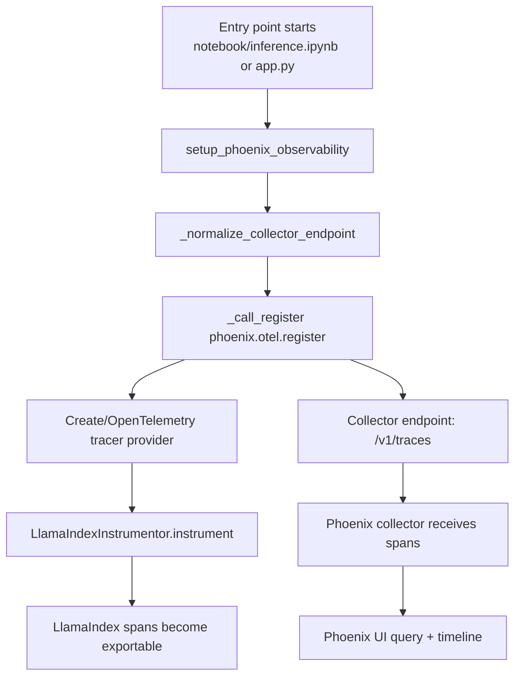
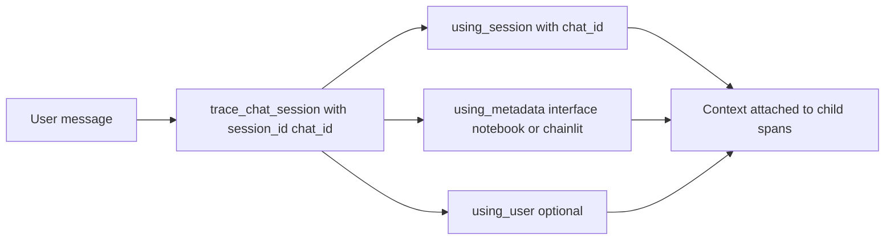
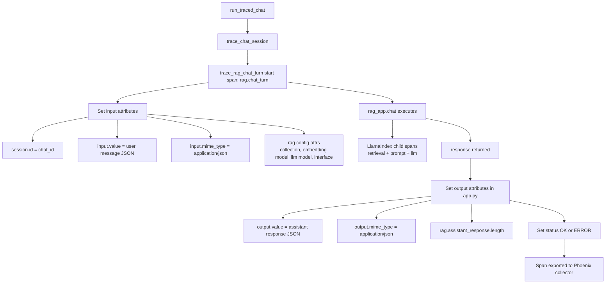
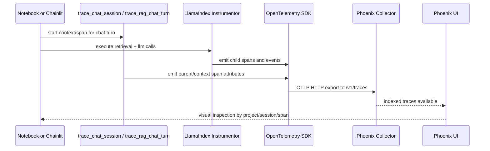
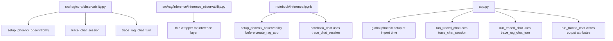

# Phoenix Observability Dataflow (Notebook + Chainlit)

This document focuses on observability dataflow only: how trace data is created, enriched, exported, and visualized in Phoenix.

## 1) Phoenix Bootstrapping Dataflow

Observability data produced at bootstrap:

1. Phoenix project name
2. Collector endpoint (normalized to OTLP traces route)
3. Tracer provider instance
4. Instrumentation state (`LlamaIndex` instrumented once)

## 2) Per-Message Trace Context Dataflow

What this context does:

1. Groups many spans under one saved chat id
2. Tags traces by interface (`notebook` vs `chainlit`)
3. Ensures retrieval and LLM spans inherit same session metadata

## 3) Chainlit Turn-Level Parent Span Dataflow

Chainlit adds one manual parent span per user turn (`trace_rag_chat_turn`), then runs `rag_app.chat(...)` inside it.

Important difference:

1. Notebook: only chat-session context wrapper
2. Chainlit app: chat-session context + explicit `rag.chat_turn` parent span

## 4) End-to-End Phoenix Trace Export Path

## 5) Attribute-Level Data Contract (what Phoenix receives)

Core attributes set by your code:

1. `session.id` = saved chat id
2. `openinference.span.kind` = `CHAIN` (for parent turn span)
3. `input.value` = JSON with user message
4. `input.mime_type` = `application/json`
5. `output.value` = JSON with assistant response (Chainlit path)
6. `output.mime_type` = `application/json` (Chainlit path)
7. `rag.interface` = `notebook` or `chainlit`
8. `rag.chat_id`, `rag.collection_name`, `rag.embedding_model`, `rag.llm_model`
9. `rag.user_message.length`, `rag.assistant_response.length`
10. Status + exception info on error

## 6) Observability-Focused Function Map

## 7) Quick Read: How Phoenix Data Passes Through Your Program

1. Startup config creates tracer provider and instruments LlamaIndex.
2. Each user message enters a session context (`chat_id`-scoped).
3. Chainlit also creates one explicit parent turn span and writes input/output JSON attributes.
4. Retrieval and LLM operations emit child spans automatically via instrumentation.
5. OpenTelemetry exporter sends spans to Phoenix collector endpoint.
6. Phoenix UI organizes traces by project and session id so you can inspect one conversation turn-by-turn.
