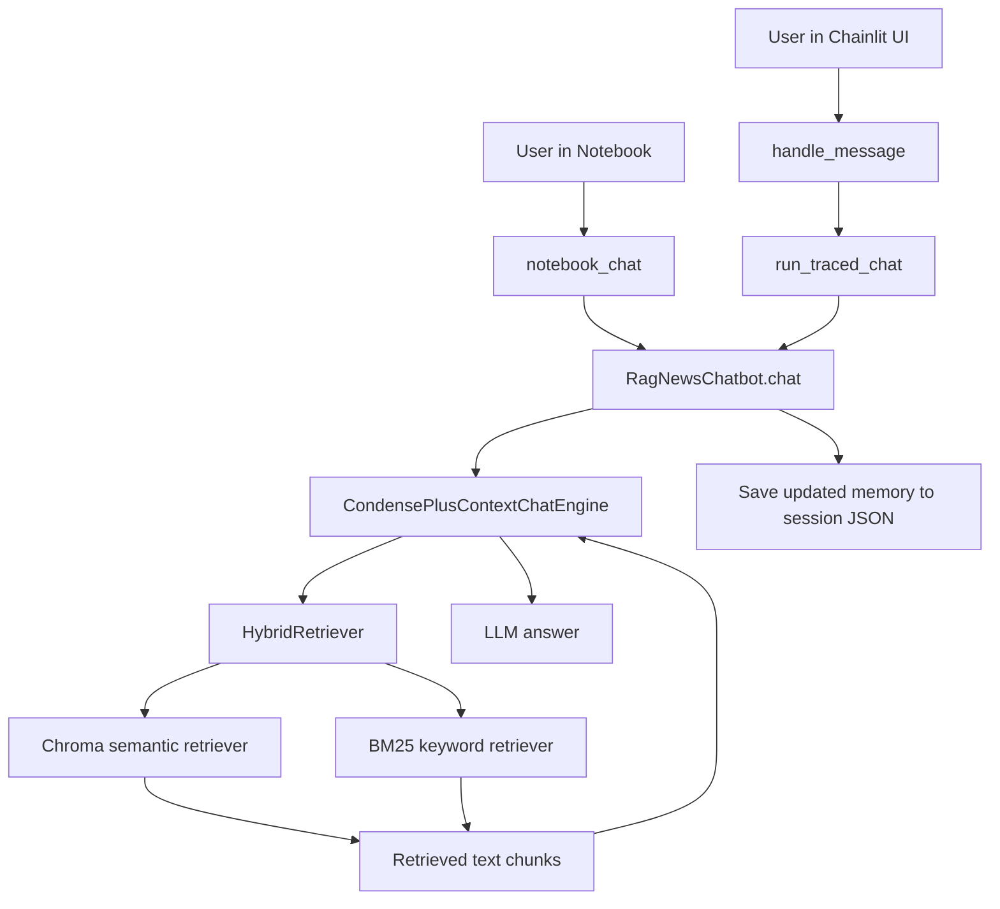
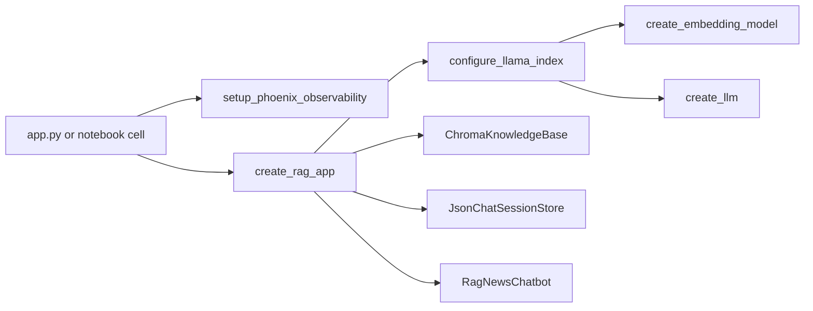
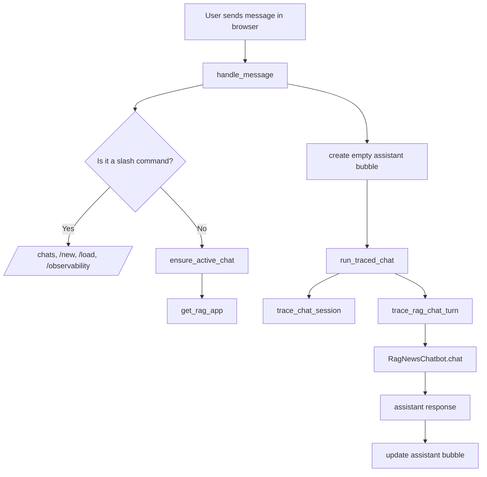
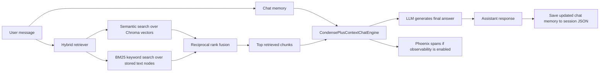

# RAG Code Logic Guide

This document explains how the main code path works in this project for a beginner. It focuses on the notebook, Chainlit UI, LlamaIndex, ChromaDB, and Phoenix.

## 1. Big Picture

There are two ways to use the same RAG backend:

1. The notebook at `notebook/inference.ipynb`
2. The web chat UI in `app.py` powered by Chainlit

Both entrypoints eventually create and use the same high-level object: `RagNewsChatbot`.



## 2. Startup Flow

The app does not start by talking to the LLM directly. It first assembles the RAG system.



### What each step means

- `setup_phoenix_observability`: turns Phoenix tracing on and connects span export to Phoenix.
- `configure_llama_index`: sets the shared default embedding model and LLM used by LlamaIndex.
- `ChromaKnowledgeBase`: reconnects to the persisted vector store in `chromadb_store/`.
- `JsonChatSessionStore`: manages saved chat files in `session/`.
- `RagNewsChatbot`: exposes easy methods like `ask(...)`, `open_chat(...)`, and `chat(...)`.

## 3. Chainlit UI Logic

The Chainlit app adds UI behavior around the shared RAG backend.



### Why Chainlit shows `rag.chat_turn`

In the Chainlit app, `run_traced_chat(...)` creates a manual Phoenix/OpenTelemetry parent span called `rag.chat_turn`. That is why Phoenix often shows that name as the top-level span for UI chat turns.

## 4. Notebook Logic

The notebook uses a slightly thinner wrapper.

```mermaid
flowchart TD
    A[User runs notebook_chat(chat_id, message)] --> B[trace_chat_session]
    B --> C[RagNewsChatbot.chat]
    C --> D[CondensePlusContextChatEngine.chat]
    D --> E[retrieval plus LLM work]
    E --> F[response returned to notebook]
```

### Why the notebook may show `CondensePlusContextChatEngine.chat`

The notebook helper adds session metadata with `trace_chat_session(...)`, but it does not create the manual `rag.chat_turn` parent span. Because of that, the auto-instrumented LlamaIndex span such as `CondensePlusContextChatEngine.chat` becomes the main visible span.

## 5. Data Flow During One Chat Turn

This is the most important flow to understand.



## 6. Main Files to Read First

If you want to learn this project in a sensible order, read these files first:

1. `app.py`
2. `src/rag/inference/factory.py`
3. `src/rag/inference/chatbot.py`
4. `src/rag/inference/knowledge_base.py`
5. `src/rag/inference/retrievers.py`
6. `src/rag/inference/session_store.py`
7. `src/rag/core/observability.py`

## 7. Mental Model

A simple mental model for this project is:

- `factory.py` builds the system.
- `chatbot.py` is the user-facing backend API.
- `knowledge_base.py` gives access to stored knowledge.
- `retrievers.py` decides which text chunks are relevant.
- `session_store.py` remembers conversations.
- `observability.py` decides what Phoenix can see.
- `app.py` is the Chainlit UI controller.
- `notebook/inference.ipynb` is the learning and experimentation entrypoint.
